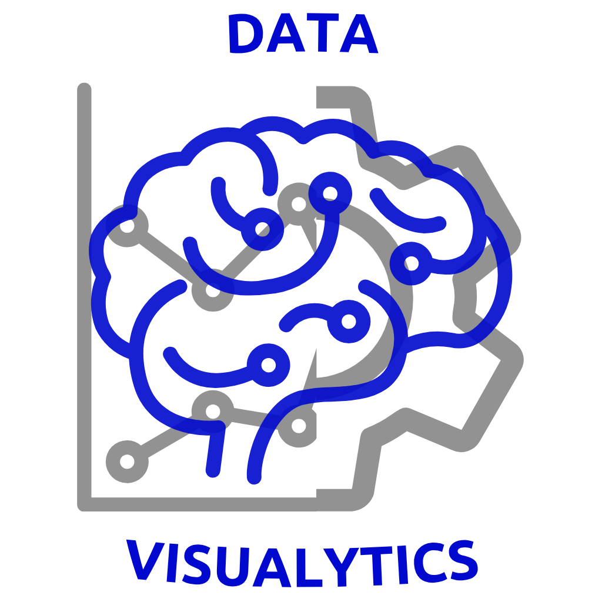
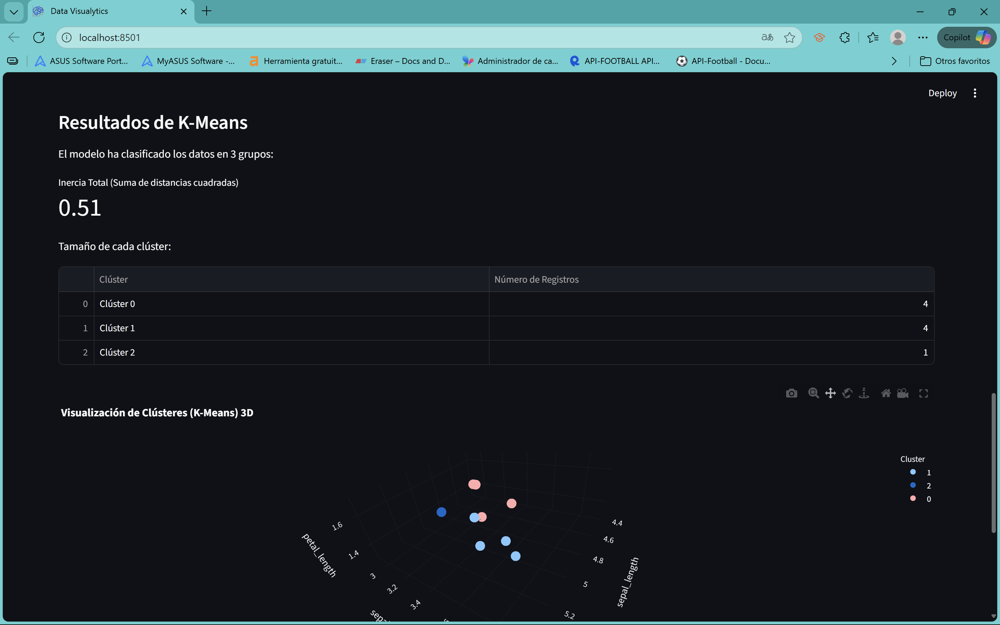

# Data Visualytics



[](https://www.python.org/downloads/)
[](https://streamlit.io/)
[](https://scikit-learn.org/)
[](https://pandas.pydata.org/)

---

## 🚀 Descripción

**Data Visualytics** es una herramienta web interactiva, construida con Streamlit, diseñada para el análisis de datos. Permite al usuario cargar sus propios conjuntos de datos, aplicar algoritmos fundamentales de *machine learning* y obtener métricas y visualizaciones.

Esta aplicación sirve como un puente entre los datos crudos y la obtención de *insights*, manejando automáticamente tareas complejas como el preprocesamiento, la codificación de variables y la validación de modelos.

## ✨ Características Principales

* **Carga de Archivos Flexible:** Soporta los formatos de datos más comunes (`.csv` y `.xlsx`).
* **Validación Robusta:** Verifica automáticamente que los archivos no estén vacíos y contengan al menos una columna numérica para el análisis.
* **Previsualización de Datos:** Muestra una vista previa de las primeras 100 filas del *dataset* cargado.
* **Modelado Interactivo:** Permite elegir entre tres algoritmos clave de Scikit-learn:
    * Regresión Lineal Múltiple
    * Regresión Logística Binaria
    * Agrupamiento (K-Means)
* **Preprocesamiento Inteligente:**
    * Aplica **Normalización** (`StandardScaler`) automáticamente a las variables (X) para algoritmos basados en distancia (K-Means, Regresión Logística y Lineal), asegurando resultados justos y comparables.
    * Maneja variables categóricas automáticamente usando codificación *One-Hot* (`pd.get_dummies`).
* **Visualización Dinámica:** Genera gráficos interactivos con Plotly para interpretar los resultados del modelo (gráfico de dispersión 2D/3D para K-Means, gráfico de coeficientes para Regresión Logística, etc.).
* **Métricas Claras:** Proporciona las métricas de evaluación esenciales para cada modelo:
    * **Regresión Lineal:** $R^2$, RMSE, Coeficientes e Intercepto.
    * **Regresión Logística:** Matriz de Confusión (con etiquetas claras), *Accuracy*, *Precision*, *Recall* y *F1-Score* enfocados en la clase positiva (ej. 'yes').
    * **K-Means:** Inercia y tamaño de cada clúster.
* **Exportación de Resultados (K-Means):** Permite descargar los datos con las etiquetas de clúster asignadas (CSV) y el gráfico interactivo (HTML).
* **Gestión de Estado Avanzada:** Incluye un botón para reiniciar sesión que limpia completamente la interfaz y el archivo cargado, listo para un nuevo análisis.

## 📸 Demostración



## 🛠️ Tecnologías Utilizadas

* **Framework Web:** Streamlit
* **Análisis de Datos:** Pandas, NumPy
* **Machine Learning:** Scikit-learn
* **Visualización de Datos:** Plotly Express
* **Manejo de Archivos Excel:** `openpyxl` (requerido por Pandas)

## 📦 Instalación y Ejecución Local

Para ejecutar esta aplicación en tu máquina local, sigue estos pasos:

1.  **Clona el repositorio:**
    ```bash
    git clone https://github.com/danybasulto/data-visualytics.git
    cd data-visualytics
    ```

2.  **Crea y activa un entorno virtual** (recomendado):
    ```bash
    # Windows
    python -m venv venv
    venv\Scripts\activate
    
    # macOS / Linux
    python3 -m venv venv
    source venv/bin/activate
    ```

3.  **Instala las dependencias:**
    Crea un archivo `requirements.txt` con el siguiente contenido:
    ```txt
    streamlit
    pandas
    scikit-learn
    plotly
    numpy
    openpyxl
    ```
    Y luego instálalo:
    ```bash
    pip install -r requirements.txt
    ```

4.  **Ejecuta la aplicación:**
    ```bash
    streamlit run app.py
    ```
    ¡Streamlit abrirá automáticamente la aplicación en tu navegador!

## 📖 Guía de Uso

1.  **Carga tus Datos:** Arrastra y suelta un archivo `.csv` o `.xlsx` en el área de carga, o usa el botón "Browse files".
2.  **Previsualiza:** Revisa que tus datos se hayan cargado correctamente en la tabla de "Vista Previa de Datos".
3.  **Configura el Análisis:**
    * Selecciona el algoritmo que deseas ejecutar.
    * Elige tus variables de atributos (X).
    * Si aplica (Regresión Lineal/Logística), selecciona tu variable objetivo (Y).
    * Si usas K-Means, define el número de clústeres (k).
4.  **Ejecuta y Explora:** Presiona el botón "Ejecutar Análisis". La aplicación mostrará las métricas, tablas y gráficos correspondientes.
5.  **Reinicia:** Si deseas analizar un archivo diferente, presiona "Reiniciar Sesión".

## 💡 Consideraciones Técnicas

Este proyecto no solo implementa los algoritmos, sino que también sigue las mejores prácticas en la preparación de datos:

* **Normalización:** Este proyecto aplica `StandardScaler` a todas las variables de entrada (X) para K-Means, Regresión Lineal y Regresión Logística. Esto previene que variables con escalas grandes (ej. "salario") dominen injustamente a variables con escalas pequeñas (ej. "hijos").
* **Manejo de Desbalanceo de Clases:** En la Regresión Logística, se utilizan los parámetros `class_weight='balanced'` y `stratify=y` en el `train_test_split`. Esto es crucial cuando se trabaja con *datasets* donde una clase es minoritaria (ej. "fumadores" vs "no fumadores"), asegurando que el modelo preste la debida atención a la clase minoritaria.
* **Gestión de Estado del Uploader:** Para solucionar un comportamiento conocido de Streamlit, el botón "Reiniciar Sesión" no solo borra los datos de la sesión, sino que implementa un "truco de clave dinámica" (incrementando un ID en `st.session_state`) para forzar al widget `st.file_uploader` a destruirse y recrearse, limpiando así su estado visual.

## 👨🏻‍💻 Autores

* **Daniel Basulto Del Toro**
* **Juan Antonio Ramirez Aguilar**